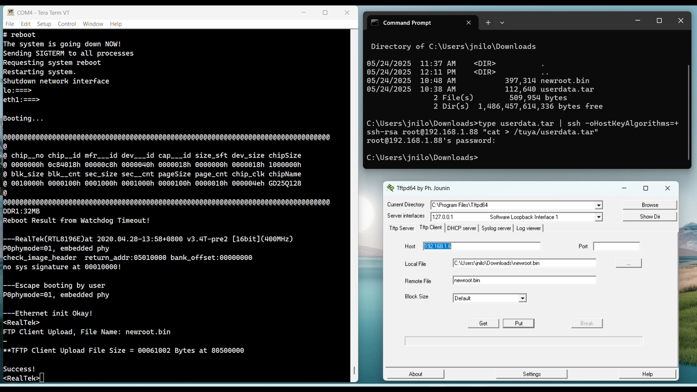

# 🛠️ Installing the New Root Filesystem (rootfs) on the Gateway

This guide explains how to install the new root filesystem (`newroot.bin`) and configure your gateway from either a **Windows** or a **Linux** host.

> ⚠️ **Important:** Before proceeding, I urge you to back up your current flash partitions. See the [20-Backup-Restore section](../20-Backup-Restore/)

---

## ✨ What's New in This Root Filesystem

This updated root filesystem includes several enhancements:

- ✅ **[BusyBox 1.37.0](https://busybox.net/)** — latest version with a revised and optimized set of applets  
- ✅ **[Dropbear 2025.88](https://matt.ucc.asn.au/dropbear/dropbear.html)** — latest version with key-only login support, and no more `-o HostKeyAlgorithms=+ssh-rsa` needed  
- ✅ **Serialgateway Supervisor** — extends Paul Bank’s original tool with automatic restart on disconnection  
- ✅ **Streamlined Init Scripts** — core scripts reside in the read-only SquashFS (`mtd2`), while editable ones are in the writable user space (`mtd4`)  
- ✅ **No More `/tuya` in mtd4** — all Tuya-related components have been removed; `mtd3` is still defined but unused  
- ✅ **Custom RootFS Support** — follow [Create the Root Filesystem](../23-Create%20the%20Root%20Filesystem/) to build your own  
- ✅ All binaries (busybox, dropbear, serialgateway) are **statically compiled**, keeping total size around 389 KB  

Enjoy your clean and powerful embedded Linux environment!

---

## 📦 Step 1: Unpack `userdata.tar` on the Gateway

### 1. Connect the Gateway

- **Ethernet** connection
- **Serial terminal** (38400 bauds, 8N1)

⚠️ Use a terminal with **auto-reconnection** capability when rebooting the gateway.

- **Windows**: 
  - I personally use a windows terminal launching [Simply Serial](https://github.com/fasteddy516/SimplySerial) with the following command line::
    ```sh
    ss -c:4 -b:38400 -p:none -d:8 -s:1 -quiet -nostatus
    ```
  - [TeraTerm](https://github.com/TeraTermProject/teraterm/releases) is also an excellent choice.
  - Avoid *Putty* which does not handle serial adapter disconnect.

- **Linux**:
  - [Minicom](https://help.ubuntu.com/community/Minicom) is the natural choice.

---

### 2. Transfer `userdata.tar` to the Gateway

- **Windows**:
  ```sh
  type userdata.tar | ssh -oHostKeyAlgorithms=+ssh-rsa root@gateway_ip "cat > /tuya/userdata.tar"
  ```

- **Linux**:
  ```sh
  ssh -oHostKeyAlgorithms=+ssh-rsa root@gateway_ip "cat > /tuya/userdata.tar" < userdata.tar
  ```

---

### 3. Unpack the Archive

```sh
cd /tuya
tar -xf userdata.tar
```
Here is the content of userdata.tar. Most files are symlinked to the readonly squashfs rootfs but can be modified since they are stored on the writable partition (mtd4) of the gateway.
```sh
├── etc
│   ├── TZ                        # Variable defining your local time zone
│   ├── dropbear                  # Directory containing dropbear server keys (generated once at first logging)
│   ├── eth1.bak                  # eth1.conf sample file for defining eth1 fixed IP
│   ├── hostname                  # Now zigbeegw but you can rename it :-)
│   ├── init.d                    # user script directory. You can add more or modify those provided below
│   │   ├── S20time               # By default launch once the ntp client to set the local time. See script header.
│   │   ├── S30dropbear           # Launch dropbear. Can be modified to restrict login through keys only. See script header.
│   │   └── S60serialgateway      # Launch my own version of serialgateway. See below for more details. 
│   ├── motd                      # Message of the day. Can be modified.
│   ├── ntp.conf                  # ntp client servers
│   ├── passwd                    # root password file
│   └── profile                   # terminal settings.
├── ssh
│   └── authorized_keys           # file to store your hosts public keys
└── usr
    ├── bin                       # You can add here any program you would like to use
    │   ├── serialgateway         # Supervise serialgateway.real to make sure serialgateway is always up and running
    │   └── serialgateway.real    # The "real", historical serialgateway.
    └── sbin                      # You can add here any program you would like to use
```

---

### 4. Customize `/tuya/etc`

#### 4.1 Disable Logging (optional)
By default `syslogd` and `klogd` daemons will be started on reboot by `S05syslog`. If you want to disable those daemons:
```sh
touch /tuya/etc/nosyslog
```

#### 4.2 Set Timezone in POSIX TZ format
The info can be found from your host linux machine with a `cat` command:
```sh
cat /usr/share/zoneinfo/Europe/Paris | strings | tail -1
# CET-1CEST,M3.5.0,M10.5.0/3
```

Place output in `/tuya/etc/TZ` (i.e.: `echo "CET-1CEST,M3.5.0,M10.5.0/3" > /tuya/etc/TZ`).

#### 4.3 Set Static IP (optional)

```sh
mv /tuya/etc/eth1.bak /tuya/etc/eth1.conf
```

Edit `eth1.conf` to match your network.

#### 4.4 Misc

Adjust:
- `hostname` and `motd`
- `S20time`, `S30dropbear` scripts (see headers)

---

## 💻 Step 2: Transfer `newroot.bin` to the Gateway

The flashing procedure is identical for both Windows and Linux. The only difference is how the newroot.bin file is transferred to the gateway.

Download `newroot.bin` and place it in the Downloads folder of your host (linux or windows).

Reboot the gateway trough the serial terminal while pressing `Esc` to access the `Realtek>` bootloader prompt. By default the bootloader is reachable over TFTP at `IP=192.168.1.6`. This address can be changed through the `IPCONFIG` bootloader command (e.g. `IPCONFIG 10.0.0.1`) if already being used or if your host is not on the same subnet.

### 🪟 Windows: Use Tftpd64

1. Download from [official site](https://pjo2.github.io/tftpd64/). Windows original `tftp` client won't work.
   Mirrors:
     * [https://tftpd64.apponic.com/download/](https://tftpd64.apponic.com/download/)
     * [https://tftpd64.software.informer.com/](https://tftpd64.software.informer.com/)
     * [https://en.freedownloadmanager.org/Windows-PC/Tftpd64-FREE.html](https://en.freedownloadmanager.org/Windows-PC/Tftpd64-FREE.html)
2. Launch the **TFTP client** tab:
   - Host: `192.168.1.6`
   - Local File: `newroot.bin`
   - Remote File: `newroot.bin`
   - Click **Put**
See the following picture with a Teraterm terminal on the left and Tftpd64 client on the right.
   <p align="center">
     
   </p>
### 🐧 Linux: Use `tftp-hpa`

```sh
tftp -m binary 192.168.1.6 -c put newroot.bin
```

---

## 🔧 Flash the Image from the Bootloader

1. Wait for this after transfer:

```
<RealTek>
**TFTP Client Upload File Size = 00061002 Bytes at 80500000
Success!
```

2. Flash it:

```sh
FLW 200000 80500000 00061002
```
Make sure that File Size is 00061002 before proceeding to the next step.
3. Confirm when prompted:

```
(Y)es, (N)o->Y
```

4. Reboot — first boot will generate SSH keys, so be patient.

---

## 🔐 Post-Install Steps

1. **Login**: `root` / `root`
2. **Change password**:
   ```sh
   passwd
   ```
3. **Clean legacy Tuya content**:

```sh
for f in /userdata/*; do
  case "$f" in
    /userdata/etc|/userdata/ssh|/userdata/usr) continue ;;
    *) rm -rf "$f" ;;
  esac
done
```

---

## ✅ You're Done!

Your gateway is now running a clean and flexible root filesystem.
