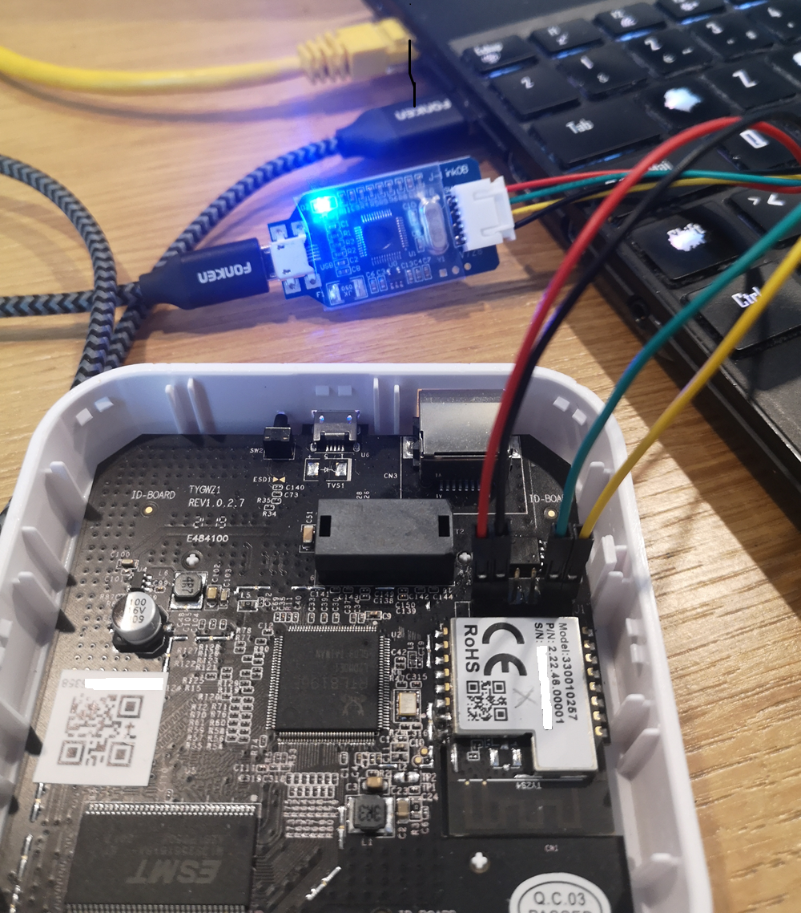

# Backup, Flash and Restore Procedure

## Overview

This guide covers the **EFR32MG1B Zigbee radio chip** firmware, not the main Linux system running on the RTL8196E SoC. The Lidl Silvercrest gateway contains two separate processors:

- **RTL8196E** (main SoC): Runs Linux 6.18 with the in-kernel `rtl8196e-uart-bridge` driver exposing the EFR32 UART on TCP:8888
- **EFR32MG1B232F256GM48** (Zigbee radio): Runs the EmberZNet/EZSP firmware covered here

Before modifying the Zigbee radio firmware, it is **strongly recommended** to back up the original firmware. This ensures you can recover in case of a failed update or configuration error.

This guide describes two main methods:

| Method | Use Case | Hardware Required |
|--------|----------|-------------------|
| **Method 1: SWD** | Full backup/restore, recovery from brick | J-Link debugger |
| **Method 2: UART** | Routine firmware updates | None (network only) |

> **Important**: Backing up the original firmware requires a hardware debugger (Method 1). The software method (Method 2) can only **flash** new firmware, not read or backup existing firmware. If you want to preserve the original Lidl firmware before experimenting, you **must** use a J-Link or compatible SWD debugger.

---

## Firmware File Types

| Format | Description | Use Case |
|--------|-------------|----------|
| **`.bin`** | Raw flash dump, byte-for-byte | Full backup/restore via SWD |
| **`.s37`** | Motorola S-Record (ASCII) | Development, some bootloaders |
| **`.gbl`** | Gecko Bootloader Image (compressed) | UART updates via bootloader |

> **Important**: For full backup or recovery, always use `.bin`. The `.gbl` format only works when the Gecko Bootloader is intact and cannot restore the bootloader itself.

---

## Method 1: Hardware Backup, Flash & Restore via SWD

### Requirements

- Lidl Silvercrest gateway with accessible SWD pins
- A J-Link or compatible SWD debugger. I personally use a cheap (less than 5 USD incl shipping) OB-ARM Emulator Debugger Programmer:
  <p align="center">  </p>

A useful investment! You can also build your own debugger with a Raspberry Pico and [`OpenOCD`](https://openocd.org/). Search the web!

- [Simplicity Studio V5](https://www.silabs.com/developers/simplicity-studio) with `commander` tool
- Dupont jumper wires (x4)

### Pinout and Wiring

| Gateway Pin | Function    | J-Link Pin |
|-------------|-------------|------------|
| 1           | VREF (3.3V) | VTref      |
| 2           | GND         | GND        |
| 5           | SWDIO       | SWDIO      |
| 6           | SWCLK       | SWCLK      |

### Backup Procedure

1. **Launch Commander** (Windows default path):
   ```bash
   cd "C:\SiliconLabs\SimplicityStudio\v5\developer\adapter_packs\commander"
   ```

2. **Check Device Connection**:
   ```bash
   commander device info --device EFR32MG
   ```

3. **Read Full Flash (256KB)**:
   ```bash
   commander readmem --device EFR32MG1B232F256GM48 --range 0x0:0x40000 --outfile original_firmware.bin
   ```

4. **(Optional) Verify Backup**:
   ```bash
   commander verify --device EFR32MG1B232F256GM48 original_firmware.bin
   ```

### Restore Procedure

```bash
commander flash --device EFR32MG1B232F256GM48 firmware.bin
```

### Flashing a `.gbl` File via SWD

If the Gecko Bootloader is functional:
```bash
commander gbl flash --device EFR32MG1B232F256GM48 firmware.gbl
```

> **Note**: This only works if the bootloader is intact. For full recovery, use `.bin`.

---

## Method 2: Software-Based Flash via UART

This method uses the in-kernel `rtl8196e-uart-bridge` (6.18 kernel) on the Lidl gateway to expose the EFR32 serial port over TCP, allowing remote firmware updates via the Gecko Bootloader.

> **Limitation**: This method only supports `.gbl` files. For full backup/restore, use Method 1 (SWD).

Use the `flash_efr32.sh` script at the repository root:

```bash
./flash_efr32.sh -y ncp                    # default IP 192.168.1.88
./flash_efr32.sh -y ncp 460800             # NCP at non-default baud
./flash_efr32.sh -y -g 10.0.0.5 otrcp      # custom gateway IP, OT-RCP
./flash_efr32.sh --help                    # full CLI reference
```

Firmware aliases: `bootloader`, `ncp`, `rcp`, `otrcp`, `router` (numeric
`1`-`5` also accepted). Per-firmware supported bauds are listed in
[`2-Zigbee-Radio-Silabs-EFR32/README.md`](../README.md#gateway-side-runtime-configuration).

The script handles everything automatically since v3.1: pulses `nRST`
for a clean chip state, installs `universal-silabs-flasher` in a venv if
needed, switches the in-kernel UART bridge to flash mode
(`flow_control=0`) via SSH, flashes the selected firmware, writes the
matching chip identity (`FIRMWARE`, `FIRMWARE_VERSION`, `FIRMWARE_BAUD`)
and daemon-routing key (`MODE`) to `/userdata/etc/radio.conf` so init
scripts arm correctly on next boot AND a future reader can tell what's
on the chip without probing it, then reboots. See
[`3-Main-SoC-Realtek-RTL8196E/34-Userdata/README.md`](../../3-Main-SoC-Realtek-RTL8196E/34-Userdata/README.md#radioconf-keys-full-reference)
for the full key reference.

> **Legacy env-var interface** (deprecated, kept for v3.0.x compat):
> `FW_CHOICE=2 BAUD_CHOICE=460800 CONFIRM=y ./flash_efr32.sh` still
> works with a deprecation warning.

See [35-Migration](../../3-Main-SoC-Realtek-RTL8196E/35-Migration/README.md#flash_efr32sh--silabs-efr32-radio-ota-via-ssh) for the per-firmware filename pattern table.

---

## Understanding universal-silabs-flasher

`universal-silabs-flasher` is a Python tool by NabuCasa that flashes Silicon Labs chips over UART without a J-Link debugger. It works by communicating with the **Gecko Bootloader** that is pre-installed on the EFR32.

> For a deep dive into how USF works over TCP, why baud rate recovery is
> tricky, and how `flash_efr32.sh` handles it, see
> [MEMO-universal-silabs-flasher.md](https://github.com/jnilo1/hacking-lidl-silvercrest-gateway/blob/main/2-Zigbee-Radio-Silabs-EFR32/22-Backup-Flash-Restore/MEMO-universal-silabs-flasher.md).

### Architecture

```
┌──────────────────────────────────────────────────────────────────────────────┐
│                     universal-silabs-flasher Flow                            │
└──────────────────────────────────────────────────────────────────────────────┘

Your PC                          Gateway                         EFR32
───────                          ───────                         ─────
    │                                │                              │
    │  socket://192.168.1.88:8888     │                              │
    ├───────────────────────────────>│  rtl8196e-uart-bridge        │
    │                                │        (TCP↔UART, kernel)    │
    │                                │                              │
    │  1. Probe firmware type        │                              │
    │  ─────────────────────────────>│──────────────────────────────>
    │                                │                              │
    │                                │<─────── Response ────────────│
    │  <─ Detects firmware type      │                              │
    │                                │                              │
    │  2. Request bootloader mode    │                              │
    │  ─────────────────────────────>│──────────────────────────────>
    │                                │       (method depends on     │
    │                                │        firmware type)        │
    │                                │                              │
    │                                │<── EFR32 reboots into ───────│
    │                                │    Gecko Bootloader          │
    │                                │                              │
    │  3. Upload firmware (Xmodem)   │                              │
    │  ─────────────────────────────>│──────────────────────────────>
    │         .gbl file chunks       │                              │
    │                                │                              │
    │  4. Bootloader writes flash    │                              │
    │                                │<────── ACK/progress ─────────│
    │                                │                              │
    │  5. Bootloader reboots         │                              │
    │                                │<── New firmware running ─────│
    │                                │                              │
    └────────────────────────────────┴──────────────────────────────┘
```

### Firmware Type Detection

The flasher automatically detects what's currently running on the EFR32 and uses the appropriate method to enter the bootloader:

| Firmware Type | How Detected | Bootloader Entry Method |
|---------------|--------------|-------------------------|
| **Gecko Bootloader** | Responds to menu commands (`1`, `2`, `3`) | Already in bootloader, proceed to Xmodem |
| **NCP (EZSP)** | Responds to EZSP protocol frames | EZSP `launchStandaloneBootloader` command |
| **RCP (CPC)** | Responds to CPC protocol frames | CPC bootloader reset command |
| **Router** | Responds `stack ver. [x.x.x]` to `version` | CLI command `bootloader reboot` |

This means you can flash **any** firmware type without knowing what's currently running. The flasher will figure it out.

### Probe Output Examples

**NCP firmware (EZSP):**
```
Probing ApplicationType.GECKO_BOOTLOADER at 115200 baud
Probing ApplicationType.EZSP at 115200 baud
Detected ApplicationType.EZSP, version '7.5.1.0 build 188'
```

**RCP firmware (CPC):**
```
Probing ApplicationType.GECKO_BOOTLOADER at 115200 baud
Probing ApplicationType.CPC at 115200 baud
Detected ApplicationType.CPC, version 'RCP v5.0.0'
```

**Router firmware:**
```
Probing ApplicationType.GECKO_BOOTLOADER at 115200 baud
Probing ApplicationType.ROUTER at 115200 baud
Detected ApplicationType.ROUTER, version 'stack ver. [7.5.1.0]'
```

**Already in bootloader:**
```
Probing ApplicationType.GECKO_BOOTLOADER at 115200 baud
Detected ApplicationType.GECKO_BOOTLOADER at 115200 baud
```

### The `flow_control` sysfs param Explained

The Gecko Bootloader uses **software flow control** (XON/XOFF), while normal firmware operation (NCP, RCP) requires **hardware flow control** (RTS/CTS).

| Bridge state | `flow_control` | Flow Control | When to Use |
|--------------|----------------|--------------|-------------|
| normal       | `1` (default)  | Hardware (RTS/CTS) | Normal operation (Z2M, ZHA) |
| flash        | `0`            | Software (none)    | Flashing via bootloader |

Write the value to the sysfs knob — the bridge stays armed, TCP:8888 never drops:
```sh
echo 0 > /sys/module/rtl8196e_uart_bridge/parameters/flow_control   # flash mode
echo 1 > /sys/module/rtl8196e_uart_bridge/parameters/flow_control   # normal
```
`flash_efr32.sh` does this automatically and restores `flow_control=1` on exit.

**Why flashing fails with `flow_control=1`:**

```
Normal mode (hardware flow control):
┌─────────────┐     RTS/CTS     ┌─────────────┐
│ kernel      │<───────────────>│   EFR32     │
│ UART bridge │                 │ (bootloader)│
└─────────────┘                 └─────────────┘
                                      │
                  Bootloader ignores RTS/CTS
                  → Xmodem responses blocked!
                  → Timeout → FailedToEnterBootloaderError

With flow_control=0 (software flow control):
┌─────────────┐      TX/RX      ┌─────────────┐
│ kernel      │<───────────────>│   EFR32     │
│ UART bridge │   (no RTS/CTS)  │ (bootloader)│
└─────────────┘                 └─────────────┘
                                      │
                  Xmodem works correctly
                  → Flash succeeds!
```

### Flash Process Step-by-Step

1. **Probe**: Flasher sends protocol-specific commands to identify firmware
2. **Bootloader entry**: Sends appropriate command based on detected type
3. **Wait for bootloader**: EFR32 reboots, bootloader sends menu
4. **Xmodem upload**: Firmware is sent in 128-byte blocks with checksums
5. **Verification**: Bootloader validates the `.gbl` signature
6. **Reboot**: Bootloader launches the new firmware

### Common Errors

| Error | Cause | Solution |
|-------|-------|----------|
| `FailedToEnterBootloaderError` | HW flow control blocking bootloader | Write `0` to `flow_control` sysfs param |
| `Failed to probe running application` | Device not responding | Power cycle gateway, check IP |
| `Xmodem timeout` | Network latency or other process using port | Use wired Ethernet, close SSH sessions |
| `GBL signature verification failed` | Corrupt or incompatible firmware | Re-download firmware, check SDK version |

### Session Conflicts

**Important:** Close all SSH sessions before flashing.

If you have an SSH session with an active `nc` or previous flasher run connected to port 8888, the new flasher instance will conflict:

```bash
# Bad: existing connection blocks new flasher
Terminal 1: ssh gateway → nc localhost 8888  (still open!)
Terminal 2: universal-silabs-flasher ...     (fails!)

# Good: close the nc session and put the bridge in flash mode
Terminal 1: ssh gateway → killall nc
           → echo 0 > /sys/module/rtl8196e_uart_bridge/parameters/flow_control
Terminal 2: universal-silabs-flasher ...     (works!)
```

---

## Quick Reference

### Flash via UART (most common)

```bash
./flash_efr32.sh -y ncp                    # NCP @ default baud, default IP
./flash_efr32.sh -y ncp 460800             # NCP @ 460800
./flash_efr32.sh -y -g 10.0.0.5 otrcp      # OT-RCP, custom IP
./flash_efr32.sh --help                    # full CLI reference
```

### Full backup via SWD

```bash
commander readmem --device EFR32MG1B232F256GM48 --range 0x0:0x40000 --outfile backup.bin
```

### Full restore via SWD

```bash
commander flash --device EFR32MG1B232F256GM48 backup.bin
```

---

## Resources

- [Simplicity Commander Reference Guide (PDF)](https://www.silabs.com/documents/public/user-guides/ug162-simplicity-commander-reference-guide.pdf)
- [universal-silabs-flasher GitHub](https://github.com/NabuCasa/universal-silabs-flasher)
- [EFR32MG1B Series Datasheet](https://www.silabs.com/documents/public/data-sheets/efr32mg1-datasheet.pdf)
- [Gecko Bootloader User Guide](https://www.silabs.com/documents/public/user-guides/ug489-gecko-bootloader-user-guide-gsdk-4.pdf)
