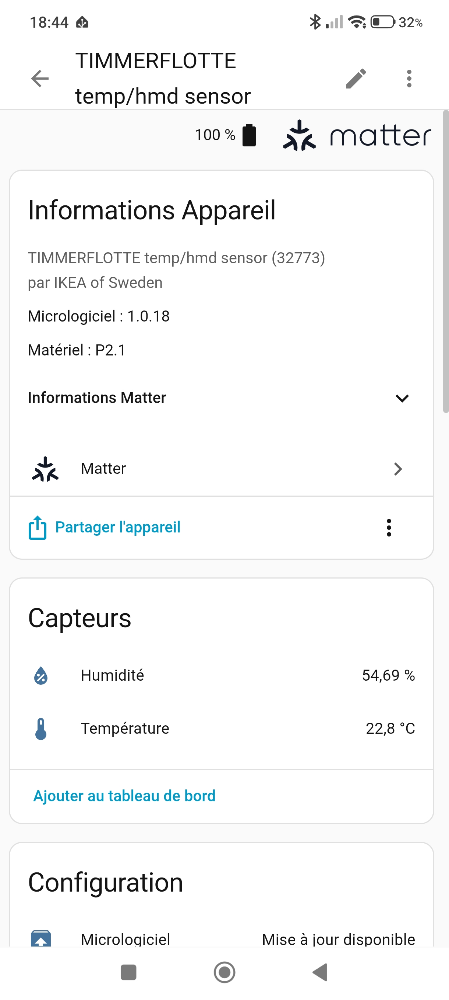

# Docker Stacks for OT-RCP Firmware

Two Docker Compose stacks for the Lidl Silvercrest Gateway running OT-RCP
firmware. Choose based on your use case:

| Stack | File | Use case |
|-------|------|----------|
| **Zigbee (zoh)** | `docker-compose-zoh.yml` | Zigbee devices via Zigbee2MQTT |
| **Thread/Matter** | `docker-compose.yml` | Matter devices via OTBR + Home Assistant |

Both stacks connect to the same gateway hardware — the OT-RCP firmware supports
Zigbee (via zigbee-on-host) and Thread/Matter (via OTBR). Only run **one stack
at a time** since they share the serial port.

## Requirements

### On the Lidl Gateway

1. **EFR32MG1B flashed with OT-RCP firmware** (`ot-rcp.gbl`)
2. **serialgateway running** on port 8888, 115200 baud

### On Your Computer

- Docker and Docker Compose
- Wired Ethernet to the gateway (recommended)
- For Thread/Matter: Bluetooth adapter (BLE commissioning)

---

## Stack 1: Zigbee (zigbee-on-host)

Runs Zigbee2MQTT with the `zoh` adapter. The Zigbee stack runs on the host
(zigbee-on-host by [@Nerivec](https://github.com/Nerivec/zigbee-on-host)),
not on the EFR32.

```
Lidl Gateway                          Docker Host
┌───────────────────────┐            ┌──────────────────────────────────┐
│                       │            │                                  │
│  EFR32 ◄───► serial   │◄── TCP ──►│  Zigbee2MQTT (zoh adapter)       │
│  (RCP)      gateway   │   :8888   │  + zigbee-on-host stack          │
│             115200    │            │  Web UI at :8080                 │
│                       │            │                                  │
└───────────────────────┘            └──────────────────────────────────┘
```

### Quick Start

1. Edit `z2m/configuration.yaml` — set your gateway IP:
   ```yaml
   serial:
     port: tcp://192.168.1.X:8888
     adapter: zoh
   ```

2. Start:
   ```bash
   docker compose -f docker-compose-zoh.yml up -d
   ```

3. Open http://localhost:8080

### Files

| File | Description |
|------|-------------|
| `docker-compose-zoh.yml` | Mosquitto + Zigbee2MQTT |
| `z2m/configuration.yaml` | Z2M config — **edit gateway IP here** |
| `mosquitto/mosquitto.conf` | MQTT broker (anonymous, ports 1883/9001) |

---

## Stack 2: Thread/Matter (OTBR + Home Assistant)

Runs an OpenThread Border Router that forms a Thread network. Matter devices
are commissioned using the **Home Assistant Companion App** on your phone —
the phone's Bluetooth handles the BLE pairing, then the device joins the
Thread network via OTBR.

```
Matter Device (e.g. IKEA TIMMERFLOTTE)
       │  Thread 802.15.4
       ▼
┌───────────────────────┐            ┌──────────────────────────────────┐
│  EFR32 ◄───► serial   │◄── TCP ──►│  OTBR (bnutzer/otbr-tcp)         │
│  (RCP)      gateway   │   :8888   │  Web UI :8080, REST API :8081    │
│             115200    │            │                                  │
└───────────────────────┘            │  Matter Server (:5580)           │
                                     │  Home Assistant (:8123)          │
                                     └──────────────────────────────────┘
                                              ▲
                                              │ BLE (commissioning)
                                     ┌────────┴────────┐
                                     │  HA Companion    │
                                     │  App (Android)   │
                                     └─────────────────┘
```

### Quick Start

#### 1. Enable IPv6 Forwarding on Your Host

Thread devices communicate over IPv6. The border router needs IPv6 forwarding
to route traffic between the Thread mesh and your local network:

```bash
sudo sysctl -w net.ipv6.conf.all.forwarding=1
```

To make this permanent:

```bash
echo "net.ipv6.conf.all.forwarding=1" | sudo tee /etc/sysctl.d/99-thread.conf
sudo sysctl --system
```

#### 2. Configure

Edit `docker-compose.yml`:

```yaml
environment:
  - RCP_HOST=192.168.1.X     # ← Your gateway's IP
  - OTBR_BACKBONE_IF=enp2s0  # ← Your host's Ethernet interface (ip link)
```

#### 3. Start the Stack

```bash
docker compose up -d
```

Wait ~30 seconds, then verify OTBR is connected:

```bash
docker exec otbr ot-ctl state
# Should print: "leader" (or "detached" → wait a bit longer)
```

#### 4. Configure Home Assistant

Open http://localhost:8123 and create your account (first time only).

Then add the required integrations in **Settings → Devices & Services → Add Integration**:

1. **Open Thread Border Router** — enter URL: `http://localhost:8081`
2. **Matter (BETA)** — should auto-detect the Matter Server on `localhost:5580`

> If Matter doesn't auto-detect, add it manually with: `ws://localhost:5580/ws`

#### 5. Set the Thread Network as Preferred

Go to **Settings → Devices & Services → Thread → Configure**. Your network
(named "OpenThreadDemo" by default) should appear. Click on it and select
**"Use as preferred network"**.

This tells Home Assistant to use this Thread network when commissioning
Matter devices.

#### 6. Install the Companion App

Install **"Home Assistant"** from the Google Play Store on your Android phone.

At first launch, enter the URL of your HA instance: `http://<HOST_IP>:8123`
(replace `<HOST_IP>` with your computer's IP address on the local network,
**not** `localhost` — your phone needs to reach it over Wi-Fi).

Log in with your HA credentials.

#### 7. Sync Thread Credentials

The Companion App needs the Thread network credentials to commission devices.
This step is **required** — without it, commissioning fails with
*"Your device requires a Thread border router"*.

In the Companion App:
**Settings → Companion App → Troubleshooting → Sync Thread credentials**

#### 8. Commission a Matter Device

You need the device's **Matter setup code** — either a QR code or an 11-digit
manual pairing code, printed on the device or its packaging.

In the Companion App or the HA web UI:
**Settings → Devices & Services → Add Device → Add Matter device**

Scan the QR code (or enter the manual code). The app will:
1. Connect to the device via **BLE** (your phone's Bluetooth)
2. Transfer the Thread network credentials
3. The device joins the Thread mesh via OTBR
4. The device appears in Home Assistant with its entities

#### 9. Verify

The commissioned device appears in **Settings → Devices & Services → Matter**
with its sensors and controls. Example with an IKEA TIMMERFLOTTE:



- Temperature: 22.8 °C
- Humidity: 54.69 %
- Battery: 100 %
- Firmware version and OTA update status

You can also verify from the command line:

```bash
# Check Thread children (commissioned devices)
docker exec otbr ot-ctl child table

# Check OTBR REST API
curl -s http://localhost:8081/node | python3 -m json.tool
```

### Services

| Port | Service | Description |
|------|---------|-------------|
| 8080 | OTBR Web UI | Thread network management |
| 8081 | OTBR REST API | Programmatic access to Thread state |
| 5580 | Matter Server | Python Matter Server WebSocket API |
| 8123 | Home Assistant | Home automation dashboard |

### Data Persistence

| Volume | Contents |
|--------|----------|
| `otbr_data` | Thread network state and credentials |
| `matter_data` | Matter fabric and device data |
| `ha_config` | Home Assistant configuration |

---

## Commissioning Notes

### BLE Advertising Timeout

Matter devices only advertise via BLE for a limited time after factory reset
(typically 15-30 minutes). If the Companion App cannot find the device,
factory reset it and try again immediately.

### Factory Reset Between Attempts

If commissioning fails partway through, the device may be in an inconsistent state.
Always factory reset the device before retrying. After a successful commissioning,
the device stops BLE advertising (it's now on Thread).

### "Your device requires a Thread border router"

The Companion App doesn't have the Thread credentials. Go to:
**Settings → Companion App → Troubleshooting → Sync Thread credentials**

### "Checking connectivity" hangs

IPv6 forwarding is likely disabled on the Docker host. Enable it:

```bash
sudo sysctl -w net.ipv6.conf.all.forwarding=1
```

Also verify that the OTBR backbone interface matches your actual Ethernet
interface (`ip link` to check, update `OTBR_BACKBONE_IF` in docker-compose.yml).

### Alternative: chip-tool (CLI)

If you prefer command-line commissioning (or don't have an Android phone),
you can use chip-tool in Docker:

```bash
# Get the Thread dataset
docker exec otbr ot-ctl dataset active -x

# Commission a device (replace values)
mkdir -p /tmp/chip-tool-storage
docker run --rm --network host --privileged \
  -v /run/dbus:/run/dbus:ro \
  -v /sys:/sys \
  -v /tmp/chip-tool-storage:/tmp \
  atios/chip-tool:latest \
  pairing code-thread <NODE_ID> \
  hex:<THREAD_DATASET> \
  <SETUP_CODE> \
  --bypass-attestation-verifier true

# Read temperature (node 1, endpoint 1)
docker run --rm --network host --privileged \
  -v /tmp/chip-tool-storage:/tmp \
  atios/chip-tool:latest \
  temperaturemeasurement read measured-value 1 1
```

Production devices (IKEA, Eve, etc.) require `--bypass-attestation-verifier true`
because chip-tool's test CA cannot verify production certificates. This is safe
for home use — it only skips the manufacturer certificate check, not the encryption.

---

## Tested Devices

| Device | Type | Protocol | Commissioning | Data Read |
|--------|------|----------|---------------|-----------|
| IKEA TIMMERFLOTTE | Temp/humidity sensor | Matter/Thread | HA Companion App (BLE) | 22.8 °C, 54.69 %, battery 100 % |

---

## Troubleshooting

### OTBR: "Failed to bind socket" / TREL error

Wrong backbone interface name. Check yours with `ip link` and update
`OTBR_BACKBONE_IF` in `docker-compose.yml`.

### Companion App: device not found / BLE scan timeout

1. The device is not advertising — factory reset it
2. Bluetooth must be enabled on your phone
3. Stay close to the device during commissioning (BLE range)

### OTBR shows "leader" but no children

The Thread network is formed but no devices have joined yet. Commission a device
via the Companion App (step 8 above).

### Matter integration shows "offline"

Check that the Matter Server container is running:

```bash
docker compose logs matter-server --tail=10
```

If it keeps restarting, ensure `/run/dbus` is accessible on the host:
`systemctl status dbus`

---

## Commands Reference

```bash
# Start Thread/Matter stack
docker compose up -d

# Start Zigbee (zoh) stack
docker compose -f docker-compose-zoh.yml up -d

# Check OTBR state
docker exec otbr ot-ctl state
docker exec otbr ot-ctl child table
docker exec otbr ot-ctl neighbor table

# Get Thread dataset
docker exec otbr ot-ctl dataset active -x

# View logs
docker compose logs -f otbr
docker compose logs -f matter-server

# Stop
docker compose down

# Full reset (deletes Thread network and all data)
docker compose down -v
rm -rf /tmp/chip-tool-storage/*
```

## References

- [bnutzer/docker-otbr-tcp](https://github.com/bnutzer/docker-otbr-tcp) — OTBR Docker image for TCP-based RCPs
- [Home Assistant Matter integration](https://www.home-assistant.io/integrations/matter/) — Official Matter documentation
- [python-matter-server](https://github.com/home-assistant-libs/python-matter-server) — Matter Server used by Home Assistant
- [Discussion #47](https://github.com/jnilo1/hacking-lidl-silvercrest-gateway/discussions/47) — Thread/Matter on the Lidl gateway
- [chip-tool guide](https://project-chip.github.io/connectedhomeip-doc/development_controllers/chip-tool/chip_tool_guide.html) — CLI commissioning reference
- [zigbee-on-host](https://github.com/Nerivec/zigbee-on-host) — Open-source Zigbee stack by Nerivec
