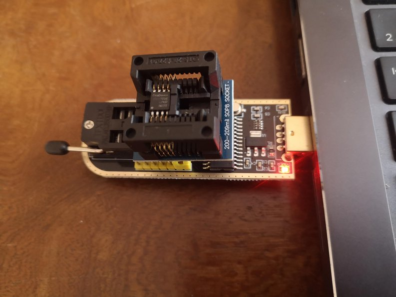

# 🧠 Backup & Restore of Embedded Flash Memory (GD25Q127C)

## Overview

The Lidl Silvercrest gateway includes a GD25Q127C  flash chip (recognized as GD25Q128C by the Linux kernel) storing the bootloader, Linux kernel, root filesystem, and Zigbee configurations.

> ⚠️ **Disclaimer**  
> Flashing or altering your gateway can permanently damage the device if done incorrectly.  
> Always ensure you have verified backups before proceeding.

This guide explains how to **back up and restore** the embedded flash memory using three distinct methods, depending on your level of access to the system:

### Which method to choose?

| | Method 1 (SSH) | Method 2 (Bootloader FLR/FLW) | Method 3 (SPI programmer) |
|---|---|---|---|
| Gateway boots | ✅ required | ✅ required | ❌ not needed |
| UART access | ❌ not needed | ✅ required | ❌ not needed |
| No service interruption | ✅ | ❌ (reboot into bootloader) | ❌ (desolder chip) |
| Works if Linux is broken | ❌ | ✅ | ✅ |
| Full flash image | ✅ (concatenate) | ✅ (single FLR command) | ✅ |
| Firmware layout | **Original only** (5 partitions) | Any | Any |
| Simplest procedure | ➖ | ✅ **recommended for full backup** | ❌ (requires hardware) |

**Method 2 (FLR/FLW) is the most practical for a full flash backup/restore**: two commands, no SSH, no password, no dependency on the running OS. Use Method 1 when you need a live backup without rebooting (e.g., to capture the current Zigbee configuration in `/tuya`).

> **Note for custom firmware users:** The SSH scripts only support the original Lidl/Tuya firmware (5 partitions). If your gateway runs the custom firmware (4 partitions), use Method 2 (FLR/FLW) for backup and restore.

---

## 🔧 Method 1 – Linux Access via SSH

✅ Use this method if the gateway runs the **original Lidl/Tuya firmware** (5 partitions, port 2333), is bootable, and reachable over SSH.

### 🔄 Backup

On the gateway (via `ssh`), run:

```sh
dd if=/dev/mtdx of=/tmp/mtdx.bin bs=1024k
```

Replace `x` with `0`, `1`, `2`, `3` or `4`.

⚠️ You must unmount `mtd4` before dumping it, as it is typically mounted read/write.

On the host, retrieve the file using `ssh` (adjust port and IP as needed):

```sh
ssh -p 2333 -o HostKeyAlgorithms=+ssh-rsa root@<GATEWAY_IP> "cat /tmp/mtdx.bin" > mtdx.bin
```

Once you have collected all partitions, concatenate them into a full image:

```sh
cat mtd0.bin mtd1.bin mtd2.bin mtd3.bin mtd4.bin > fullmtd.bin
```

💡 Refer to the script section at the end of this README to automate this process.

---

### ♻️ Restore

⚠️ This method will only work to restore original partitions coming from the **same** machine. Modified partitions or partiions coming from another machine will have to be restored with Method 2 below.
⚠️ Only restore partitions that are **not mounted**.  
- `mtd0` to `mtd3` are usually safe to write.  
- `mtd4` (overlay) is mounted read/write — unmount it before restoring. This generally means:
```
killall -q serialgateway
umount /dev/mtdblock4
```

To restore, first transfer the file to the gateway:

```sh
ssh -p 2333 -o HostKeyAlgorithms=+ssh-rsa root@<GATEWAY_IP> "cat > /tmp/rootfs-new.bin" < rootfs-new.bin
```

Then flash it:

```sh
ssh -p 2333 -o HostKeyAlgorithms=+ssh-rsa root@<GATEWAY_IP> "dd if=/tmp/rootfs-new.bin of=/dev/mtd2 bs=1024k"
```

💡 Refer to the script section at the end of this README for a simpler approach.


## 🔧 Method 2 – Bootloader Access (UART + TFTP)

🟠 Use this method if Linux no longer boots, but the Realtek bootloader is still accessible via UART.

💡 FLR/FLW reads raw flash regardless of filesystem state — it is the **recommended method for a preventive full backup** (before any modification).

⚠️ However, if Linux fails to boot due to a corrupted partition, a backup taken at that point will faithfully capture the corrupted data. In that situation, restoring a **previously saved healthy backup** is the right approach.


### 🛠 Setup

This second method uses the Realtek bootloader's `FLR` and `FLW` commands to transfer data via TFTP.

#### Install a TFTP client on your Linux host
```sh
sudo apt install tftp-hpa
```

#### Accessing the Bootloader
- Connect a USB-to-serial adapter to your host, and wire its RX/TX pins to the gateway's UART interface.
- Power on (or reboot) the gateway while pressing the ESC key until the `<RealTek>` prompt appears on the serial console.
- The bootloader's TFTP server listens on **192.168.1.6** by default. Make sure your PC is on the same subnet.

---

### 🔄 Full Flash Backup (recommended)

**This is the safest approach.** It captures the entire 16 MiB flash chip as a single image, regardless of the partition layout. Use this before any modification.

#### Step 1 — Load the entire flash into RAM

On the bootloader:
```plaintext
RealTek>FLR 80500000 00000000 01000000
Flash read from 0 to 80500000 with 1000000 bytes        ?
(Y)es , (N)o ? --> Y
Flash Read Succeeded!
```
- `80500000` → RAM address where data will be loaded
- `00000000` → start of flash (offset 0)
- `01000000` → full flash size: 16 MiB

Confirm with `Y` when prompted and wait for `Flash Read Succeeded!` before proceeding.

#### Step 2 — Download the image to your host

```sh
tftp -m binary 192.168.1.6 -c get flash_full.bin
```

The resulting `flash_full.bin` is exactly **16,777,216 bytes** and can be restored at any time using Method 3 (SPI programmer) or the procedure below.

💡 Use a direct Ethernet cable for best reliability. You can verify the transfer with `md5sum flash_full.bin`.

---

### ♻️ Full Flash Restore

Use this to restore a previously saved full image.

#### Step 1 — Upload the image to the gateway

On the bootloader:
```plaintext
RealTek>LOADADDR 80500000
```

From the host:
```sh
tftp -m binary 192.168.1.6 -c put flash_full.bin
```

#### Step 2 — Write the full flash

Back on the bootloader:
```plaintext
RealTek>FLW 00000000 80500000 01000000 0
```

⚠️ This overwrites the **entire flash chip**. Double-check the image before proceeding.
⚠️ All values are in hexadecimal.

---

### 🗂 Original Lidl/Tuya Flash Partition Map

> ⚠️ The table below reflects the **original Lidl/Tuya firmware** partition layout.
> The custom firmware described in this repository uses a **different layout with one fewer partition** (the Tuya Label partition is removed and the remaining space reallocated).
> When working with the custom firmware, refer to the partition map in `32-Kernel/`.

| MTD  | Description         | Offset       | Size         |
|------|---------------------|--------------|--------------|
| mtd0 | Bootloader + Config | `0x00000000` | `0x00020000` (128 KiB) |
| mtd1 | Kernel              | `0x00020000` | `0x001E0000` (1.875 MiB) |
| mtd2 | Rootfs              | `0x00200000` | `0x00200000` (2 MiB) |
| mtd3 | Tuya Label          | `0x00400000` | `0x00020000` (128 KiB) |
| mtd4 | JFFS2 Overlay       | `0x00420000` | `0x00BE0000` (~11.875 MiB) |

---

### 📎 Appendix: Per-Partition Backup and Restore

Use this only when you need to back up or restore a **specific partition** rather than the full flash.

#### Backup a partition (FLR)

`FLR` (Flash Load to RAM) reads a flash region into RAM, then the bootloader exposes it via TFTP for download.

```plaintext
FLR <ram_addr> <flash_offset> <size>
```

Example — backup rootfs (mtd2):
```plaintext
RealTek>FLR 80500000 00200000 00200000
(Y)es , (N)o ? --> Y
Flash Read Succeeded!
```
```sh
tftp -m binary 192.168.1.6 -c get mtd2.bin
```

#### Restore a partition (FLW)

`FLW` (Flash Write from RAM) writes RAM content to flash.

```plaintext
FLW <flash_offset> <ram_addr> <size> 0
```

Example — restore rootfs (mtd2):
```plaintext
RealTek>LOADADDR 80500000
```
```sh
tftp -m binary 192.168.1.6 -c put mtd2.bin
```
```plaintext
RealTek>FLW 00200000 80500000 00200000 0
```

⚠️ Always double-check offset and size before writing. This operation is destructive.

#### FLR / FLW quick reference (original Lidl/Tuya layout)

| MTD  | Description         | FLR Command                        | FLW Command                        |
|------|---------------------|------------------------------------|------------------------------------|
| mtd0 | Bootloader + Config | `FLR 80500000 00000000 00020000`   | `FLW 00000000 80500000 00020000 0` |
| mtd1 | Kernel              | `FLR 80500000 00020000 001E0000`   | `FLW 00020000 80500000 001E0000 0` |
| mtd2 | Rootfs              | `FLR 80500000 00200000 00200000`   | `FLW 00200000 80500000 00200000 0` |
| mtd3 | Tuya Label          | `FLR 80500000 00400000 00020000`   | `FLW 00400000 80500000 00020000 0` |
| mtd4 | JFFS2 Overlay       | `FLR 80500000 00420000 00BE0000`   | `FLW 00420000 80500000 00BE0000 0` |

---

## 🔧 Method 3 – SPI Programmer (CH341A or Equivalent)

🔴 Use this method only if the bootloader is corrupted or the gateway is completely unresponsive.

This method involves **physically desoldering the SPI flash chip (GD25Q127C)** from the board and using a USB SPI programmer (such as a CH341A) to read or write its content.

### 🛠 Required Hardware

- A **CH341A** USB SPI programmer (inexpensive and widely available). Use the 25xx entry.
- Make sure the chip is properly seated in the adapter.
- A SOP8 to **200 mil** DIP adapter to insert the chip into the programmer
- **Flux** and either **desoldering braid** or a **small desoldering pump**


   <p align="center">
     
   </p>


⚠️ The use of a programming clip **does not work** on the gateway board and is not recommended.

### ✅ Make sure the chip is recognized by `flashrom`

```sh
jnilo@HP-ZBook:./flashrom -p ch341a_spi -c GD25Q128C
flashrom v1.6.0-devel (git:v1.5.0-44-g4d4688cc) on Linux 6.8.0-57-generic (x86_64)
flashrom is free software, get the source code at https://flashrom.org

Found GigaDevice flash chip "GD25Q128C" (16384 kB, SPI) on ch341a_spi.
No operations were specified.
```
If the package version provided by your linux distro does not detect the chip, check your connection and make sure to install the latest version of [flashrom](https://github.com/flashrom/flashrom). Information about installation can be found on the [flashrom web site](https://www.flashrom.org/).

### ♻️ Restore using `flashrom`

To restore a previously saved image to the flash chip (like **fullmtd.bin** previously created using **Method 1**) use `flashrom` write mode `-w`(flash binary to chip)

```sh
flashrom -p ch341a_spi -c GD25Q128C -w fullmtd.bin
```

The output will look like:

```sh
jnilo@HP-ZBook:./flashrom -p ch341a_spi -c GD25Q128C -w fullmtd.bin 
flashrom v1.6.0-devel (git:v1.5.0-44-g4d4688cc) on Linux 6.8.0-57-generic (x86_64)
flashrom is free software, get the source code at https://flashrom.org

Found GigaDevice flash chip "GD25Q128C" (16384 kB, SPI) on ch341a_spi.
Reading old flash chip contents... done.
Updating flash chip contents... Erase/write done from 0 to ffffff
Verifying flash... VERIFIED.
jnilo@HP-ZBook:
```


⚠️ **Be careful:** This operation will completely overwrite the chip content.   
⚠️ **Be patient:** This operation takes a while.   
⚠️ Ensure that `fullmtd.bin` is exactly **16 MiB (16,777,216 bytes)** and contains valid data.

## 📁 Included Scripts

| Script                                | Method   | Description                                                        |
|---------------------------------------|----------|--------------------------------------------------------------------|
| `scripts/backup_mtd_via_ssh.sh`       | Method 1 | Backup one or all partitions via SSH (original firmware only)      |
| `scripts/restore_mtd_via_ssh.sh`      | Method 1 | Restore one or all partitions via SSH (original firmware only)     |

### Usage

Both scripts connect to the gateway, detect the partition layout from `/proc/mtd`, and abort with FLR/FLW instructions if the custom firmware (4-partition) layout is detected.

The default port is `2333` (original Lidl/Tuya firmware). The `-o HostKeyAlgorithms=+ssh-rsa` option is added automatically for compatibility with the old Dropbear daemon.

```sh
# Backup all partitions
./scripts/backup_mtd_via_ssh.sh all <gateway_ip>

# Restore all partitions
./scripts/restore_mtd_via_ssh.sh all <gateway_ip>

# Single partition
./scripts/backup_mtd_via_ssh.sh mtd2 <gateway_ip>
./scripts/restore_mtd_via_ssh.sh mtd2 <gateway_ip>
```

If the gateway runs the custom firmware, the scripts will print:
```
Error: 4-partition layout detected — this is the custom firmware.
SSH backup/restore is not supported for this layout.

Use the bootloader FLR/FLW commands instead: ...
```


